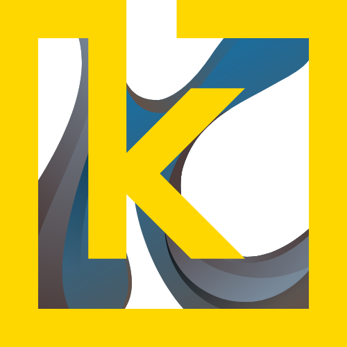

[![LinkedIn][linkedin-shield]][linkedin-url]

<!-- PROJECT LOGO -->
 

    
    <h3 align="center">KWADRA UI</h3>
    

        UI Pillar of Kwadra Project
    

<!-- TABLE OF CONTENTS -->

  
Table of Contents

  <ol>
    <li>
      <a href="#about-the-project">About The Project</a>
      <ul>
        <li><a href="#built-with">Built With</a></li>
      </ul>
    </li>
    <li><a href="#license">License</a></li>
    <li><a href="#contact">Contact</a></li>
  </ol>

<!-- ABOUT THE PROJECT -->
## About The Project

This project is one of the pillars of the Kwadra project. Kwadra aims to focus on developing a fullstack demo project that will integrate IOT, AI to a more classic fullstack project that includes API and UI components.

UI content:
* TBD

(<a href="#readme-top">back to top</a>)

### Built With
- Flutter 3.22.0
- Dart 3.4.0

(<a href="#readme-top">back to top</a>)

<!-- LICENSE -->
## License

Distributed under the GNU Affero General Public License v3.0. See `LICENSE.txt` for more information.

<!-- CONTACT -->
## Contact

X [@Nikoden_IO](https://x.com/Nikoden_IO) - Email [contact@nikoden.io](mailto:contact@nikoden.io)

Project Link: [https://github.com/nikoden-io/Kwadra-API](https://github.com/nikoden-io/Kwadra-API)

<!-- MARKDOWN LINKS & IMAGES -->
<!-- https://www.markdownguide.org/basic-syntax/#reference-style-links -->
[linkedin-shield]: https://img.shields.io/badge/-LinkedIn-black.svg?style=for-the-badge&logo=linkedin&colorB=555
[linkedin-url]: https://www.linkedin.com/in/nicolas-denoel/
